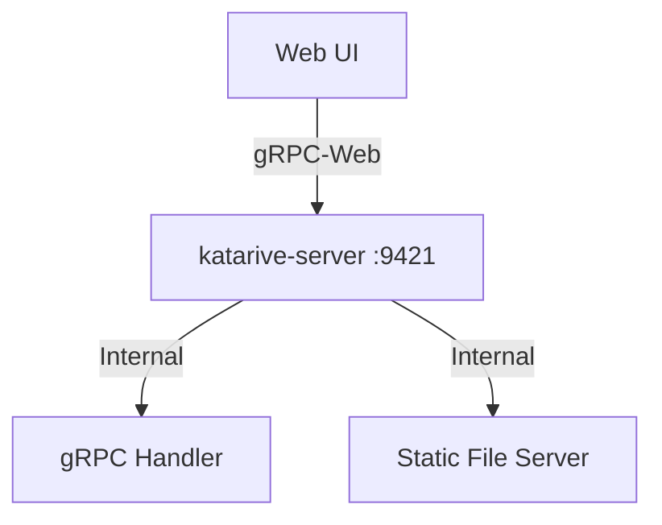

# Katarive Web UI

A premium, glassmorphism-themed Web interface for the **Katarive** audio narration service. This frontend communicates directly with the Katarive gRPC server via gRPC-Web.

## 🚀 Features

- **Beautiful UI**: Modern dark-mode glassmorphism design with smooth animations.
- **Direct gRPC Communication**: Connects directly to the Go server without requiring an external proxy sidecar.
- **Real-time Status Polling**: Automatically polls the server for job status and updates the UI.
- **Integrated Audio Player**: Instantly play generated narrations once a job is complete.
- **Comprehensive Logging**: Detailed RPC interceptors for easy debugging in the browser console.

## 🏗️ Architecture

The system uses a unified architecture where the Go server handles native gRPC, gRPC-Web, and static files on a single port.



## 🛠️ Usage

### Prerequisites

- [Node.js](https://nodejs.org/) (v18+)
- [Katarive Server](https://github.com/heptaliane/katarive-server) (Running on port 9421)

### Installation

```bash
npm install
```

### Development

Run the development server with Hot Module Replacement (HMR):

```bash
npm run dev
```

### Production Deployment

To build the UI for hosting on a Katarive server:

```bash
npm run build
```

Once built, manually copy the contents of the `dist/` directory to your server's static web directory (e.g., `web/` in the server root). Access the UI at: `http://<server-address>:9421/static/`

## 📜 Available Scripts

- `npm run gen`: Generates TypeScript client code from remote Protobuf definitions.
- `npm run dev`: Starts the Vite development server.
- `npm run build`: Builds the production-ready bundle in the `dist/` directory.
- `npm run test`: Runs the Vitest test suite.

## ⚙️ Environment Variables

Copy `.env.example` to `.env` to customize your setup:

| Variable | Default | Description |
| :--- | :--- | :--- |
| `VITE_GRPC_WEB_URL` | (empty) | The gRPC-Web URL. Defaults to the current origin. |
| `VITE_AUDIO_BASE_URL` | (empty) | Base URL for fetching audio files. Defaults to the current origin. |

---

Developed with ❤️ for the Katarive project.
